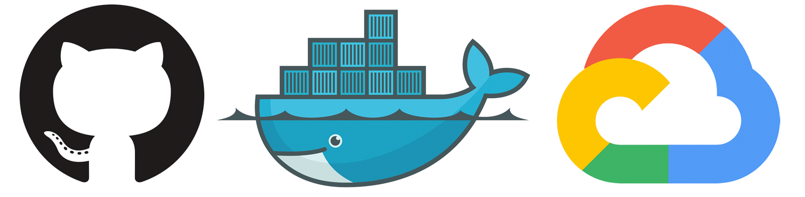

# Creating a CI/CD Environment for Serverless Containers on Google Cloud Run

## Architecture

This is how our infrastructure works:



## Golang

Running:

```bash
$ go run server.go
```

Running tests:

```bash
$ go test -v
```

Running Dockerfile:

```bash
$ docker build . -t example

$ docker run -p 8000:8000 --env PORT=8000 example
```
